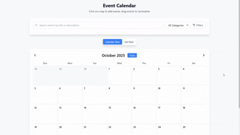

---
## 📽️ Demo




````markdown
# 🗓️ Modern Event Calendar

A responsive and interactive calendar application built using **React** and **Tailwind CSS**. This project allows users to manage both single and recurring events through a clean and user-friendly interface.

---

## ⚙️ Setup Instructions

Follow these steps to run the project locally:

```bash
cd frontend
npm install
npm run dev
````

> Make sure you have Node.js and npm installed on your machine.

---

## 🌐 About the Project

The **Modern Event Calendar** is designed to help users easily manage events on a monthly calendar view. Users can create, view, and delete events—whether one-time or recurring (daily, weekly, or monthly). The UI is built with responsiveness in mind, ensuring a great experience across all devices.

---

## ✨ Features

* 📅 **Monthly Calendar View** – Displays full month with week alignment.
* 📝 **Add Events** – Create events using a modal form.
* ♻️ **Recurring Events** – Support for daily, weekly, and monthly recurrence.
* 🧠 **Smart Filtering** – Automatically shows events based on selected day.
* ✏️ **Edit/Delete Events** – Modify or remove existing events (coming soon).
* 📦 **Drag & Drop (Optional)** – Easily move events between dates.


---

## 📦 Tech Stack

* **React.js** – Frontend framework
* **Tailwind CSS** – Utility-first CSS framework
* **date-fns** – Lightweight date manipulation library
* **Lucide Icons** – Clean and customizable icons

---

---

## 🧑‍💻 Contributing

Contributions are welcome! If you have ideas for new features or improvements, feel free to fork the repo and submit a pull request.


